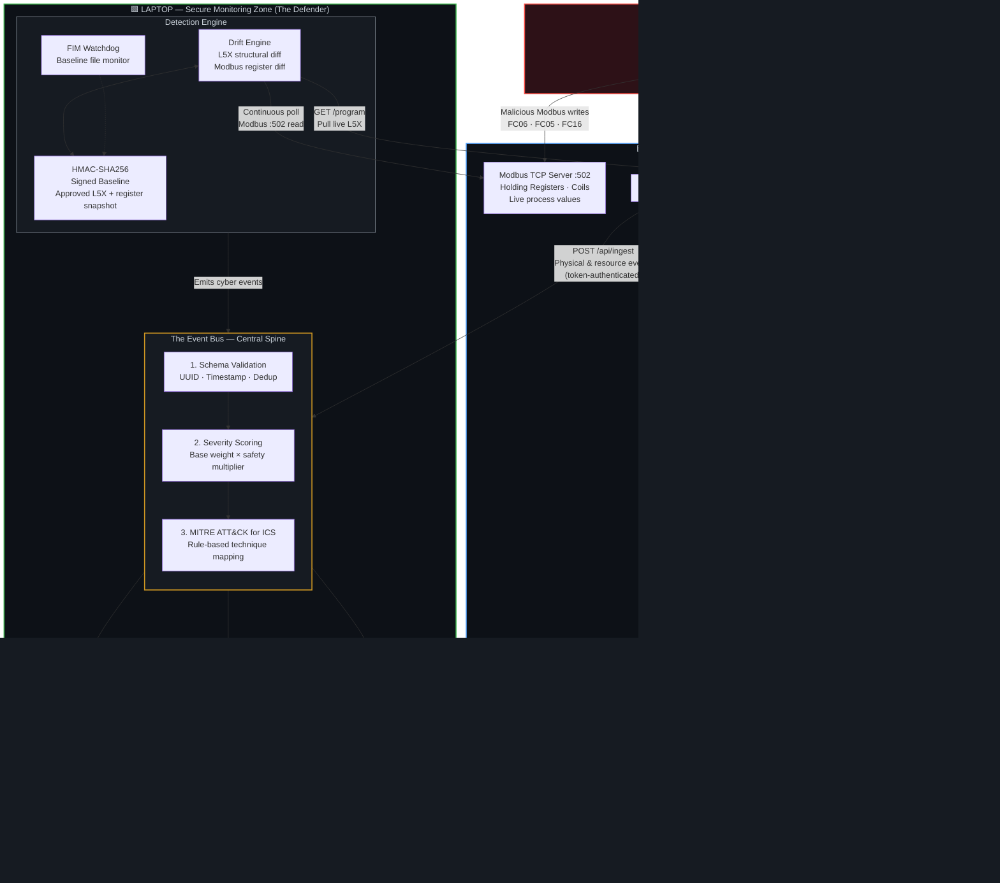
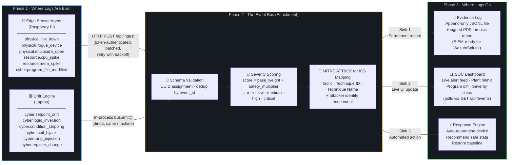

# LogicWard

**Live OT drift-detection appliance** — detect unauthorized PLC logic changes on a simulated thermal power plant before they become operational risk.

> **[USAGE.md](USAGE.md)** — complete how-to (run, demo, dashboard tour, attacker CLI, Pi deployment, config, troubleshooting).
> **[LogicWard_Demo_Guide.pdf](LogicWard_Demo_Guide.pdf)** — presenter runbook (attack → detection → dashboard → MITRE, act by act).
> Full specification: **[DESIGN.md](DESIGN.md)** · shareable **[LogicWard_Design.pdf](LogicWard_Design.pdf)** (also `.tex`).

## What it is

A Raspberry Pi runs a Modbus TCP PLC (a thermal power plant) plus a thin sensor **agent**. A second machine is the **attacker**. A laptop runs the detection **engine** + a Flask **SOC dashboard**. Every sensor/detector across three planes (cyber, physical, resource) emits **one event contract** onto a single **event bus**, which enriches each event with attacker identity + a MITRE ATT&CK for ICS technique, logs it as evidence, and streams it to the dashboard.

The PLC "program" is a real **Rockwell L5X** file — **data to baseline and diff, never executed.** Detection is a continuous live-vs-baseline diff across two surfaces: the structural program (canonicalized L5X) and the live Modbus register state.

## Key capabilities

- **Real L5X parsing + canonicalization** — strips volatile export/edit dates, revisions, CRC, and comments, so a re-export with no logic change produces an identical hash (no false positives), while real changes are caught.
- **Six named mutations** — setpoint drift, logic inversion, condition stripping, coil hijack, rung injection, raw register change — each scored by criticality and mapped to an ICS technique.
- **HMAC-SHA256 signed baseline** — tampering the locked baseline breaks the signature.
- **Passive FIM (`watchdog`)** — watches the Pi's running `live.L5X` and the laptop's signed baseline.
- **GitHub-style diff** — side-by-side red/green rung diff with word-level highlights.
- **Animated SCADA mimic** — a live single-line diagram of the plant (fuel → boiler → turbine → generator → 115 kV grid); components redline, pulse, and pin their MITRE technique the instant an attack lands, click to acknowledge.
- **Evidence log (SIEM-ready JSONL) + signed PDF** forensic report.
- **RBAC dashboard** — Operator / Engineer / SOC Analyst, with role-gated response actions.

## System architecture

LogicWard runs across **three hosts**. The attacker only ever touches the Pi — the monitor observes it remotely, mirroring a real-world OT deployment.



### Event & log flow

Every detection — whether born on the Pi or the laptop — follows the same path through the event bus before reaching its final destination.



### Deployment modes

Runs single-machine by default (an **embedded plant**); set `LOGICWARD_EMBED_PLANT=0` for the real Pi split — **verified end-to-end on a Raspberry Pi 4 ↔ laptop over Wi-Fi** (cyber detection + agent event-forwarding both live).

## Status — built & verified (98/98 automated checks)

| Stage | Component | State |
|------|-----------|-------|
| Event bus | `engine/{events,server,mitre_map}` + `agent/forwarder` | ✅ `smoke_bus` 15/15 |
| L5X engine | `engine/l5x` + `plant/program/ThermalPlant_baseline.L5X` | ✅ `smoke_l5x` 16/16 |
| Plant | `plant/{modbus_server,logic_store,rung_to_register}` | ✅ `smoke_plant` 14/14 |
| Cyber plane | `engine/baseline` (HMAC) + `engine/drift` (6 mutations) | ✅ `smoke_drift` 18/18 |
| Agent plane | `agent/agent` + `sensors/{link_watch,arp_watch,gpio_tamper,resource,fim_watch}` | ✅ `smoke_agent` 10/10 |
| Dashboard | `dashboard/{app,evidence}` + templates/static (RBAC, animated mimic, diff, PDF) | ✅ `smoke_dashboard` 15/15 |
| Attacker | `attacker/{attacks,demo_sequence}` | ✅ `smoke_attacker` 10/10 |
| Two-host Pi run | Raspberry Pi 4 (Modbus PLC + agent) ↔ laptop (engine + dashboard) over Wi-Fi | ✅ verified on real hardware — cyber + agent-forward paths live end-to-end |

## Quick start (single machine)

```bash
pip install -r requirements.txt

# 1) Run the SOC dashboard (embedded plant) — login soc/soc123
python -m logicward.dashboard.app          # http://localhost:8080/

# 2) One-command live show: brings up the whole stack + runs normal -> attack -> detection
python -m logicward.attacker.demo_sequence         # watchable pacing (~90s)
python -m logicward.attacker.demo_sequence --fast  # quick flow smoke

# 3) Run any verification suite
python -m logicward.tests.smoke_drift      # (bus | l5x | plant | drift | agent | dashboard | attacker)
```

Logins: `operator/operator123` · `engineer/engineer123` · `soc/soc123`.

## Run against a real Pi (split deployment) — verified

Scripted in [`deploy/`](deploy/) and walked through in **[USAGE.md §7](USAGE.md)**. Tested on a Raspberry Pi 4 (Raspberry Pi OS 64-bit) and a Windows laptop sharing a Wi-Fi hotspot.

```bash
# On the Pi (both devices on the same Wi-Fi):
bash deploy/pi_bootstrap.sh <laptop-ip>        # venv + deps + ingest URL
bash deploy/run_pi.sh                           # PLC (:5020) + program (:8081) + agent

# On the laptop:
#   (one-time) allow inbound 8080:  netsh advfirewall firewall add rule name="LogicWard" dir=in action=allow protocol=TCP localport=8080
.\deploy\run_laptop.ps1 -PiHost siddhesh.local  # dashboard in remote mode (reads the Pi)

# From the attacker box (or the laptop):
python -m logicward.attacker.attacks --host siddhesh.local logic-inversion
```

> The agent uses `wlan0` on a Wi-Fi Pi (the bootstrap sets this). If the repo is **private**, the Pi can't `git clone` it — copy the working tree from the laptop instead (`tar … | ssh pi "tar x"`), or make the repo public. Campus Wi-Fi often blocks device-to-device (client isolation); a phone hotspot is the reliable fallback.

## Configuration

All deployment values live in [`logicward/config.py`](logicward/config.py), each overridable with a `LOGICWARD_*` environment variable (e.g. `LOGICWARD_INGEST_URL`, `LOGICWARD_PI_HOST`, `LOGICWARD_TOKEN`, `LOGICWARD_HMAC_KEY`, `LOGICWARD_EMBED_PLANT`, `LOGICWARD_MODBUS_PORT`).

## Layout

```
logicward/
  plant/      modbus_server, logic_store, rung_to_register, program/*.L5X          (Pi)
  agent/      forwarder, agent + sensors/{link_watch,arp_watch,gpio_tamper,
              resource,fim_watch}                                                  (Pi)
  engine/     events (the bus), server, mitre_map, l5x, l5x_diff, baseline,
              drift, response, sources, modbus_client                             (laptop)
  dashboard/  app (RBAC), evidence (PDF), templates/, static/                     (laptop)
  attacker/   attacks, demo_sequence                                              (2nd machine)
  tests/      smoke_{bus,l5x,plant,drift,agent,dashboard,attacker}.py
  config.py
```

## Reuse

Lifted and re-themed from three prior repos: **OT_SECURITY** (Modbus server + attacker framework), **PiSentinel** (Flask dashboard shell, ARP + CPU/RAM sensors), **Prahari** (scoring model, demo choreography, SOC design language). See DESIGN.md §10.

## Notes

- MITRE ATT&CK-for-ICS technique IDs in `engine/mitre_map.py` are rule-based and **verified against the live ICS matrix** (each mapping carries a `verified` flag; physical/baseline tamper with no matching technique are honestly marked `N/A`).
- Demo-grade auth (plaintext passwords) and a static HMAC/ingest token are intentional for the demo and documented as such.
